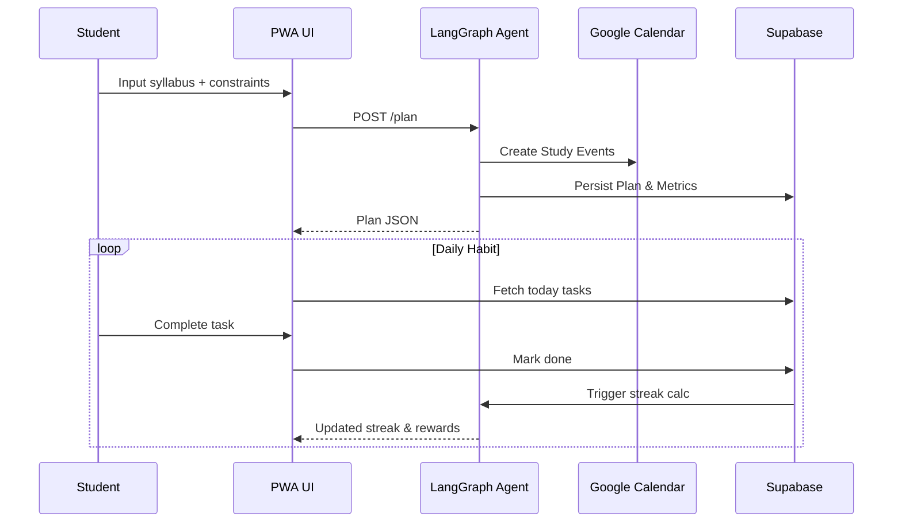

# StudyStreak – Panda Hacks 2025 Project Proposal

> Built for the **Agentic AI** track (with bonus alignment to No-/Low-Code & Game Design tracks).

---

## 1. Solution Name
**StudyStreak – Your Personalised, Gamified Study Companion**

A privacy-first, agentic platform that plans, nudges, and rewards effective study habits for high-school students—online *and* offline.

---

## 2. Problem & Opportunity
High-schoolers struggle with consistent study routines and lose motivation rapidly. Existing AI tutors focus on *answers*, not *habits*. StudyStreak tackles the *behavioural* gap: turning spaced repetition, self-regulated-learning (SRL), and peer accountability into an engaging, streak-based game powered by an autonomous AI planner.

---

## 3. Key Features
| # | Feature | Track Alignment | Description |
|---|---------|----------------|-------------|
|1 | Agentic Study Planner | Agentic AI | GPT-4o (function-calling via LangGraph) analyses syllabus & calendar, then books bite-sized study blocks directly into students’ calendars. |
|2 | Gamified Spaced-Practice Streaks | Game Design | “Counting Days” algorithm rewards distributed effort; leaderboards & avatars spark friendly competition. |
|3 | Vision-Quizzing | Agentic AI | Snap textbook page → agent generates quiz & adds to next session. |
|4 | AR Study Cards | Game Design | WebXR & Three.js overlay 3-D models on printed flashcards for immersive learning. |
|5 | Peer-Pod Matching | No/Low-Code | One-click module that auto-groups 3-5 students with complementary weaknesses; AI co-moderates sessions. |
|6 | Offline Edge-LLM Mode | Impact | On-device Mistral/Phi-3 keeps core planning & flashcard quiz running without internet, syncing later. |
|7 | Teacher Dashboard (Low-Code) | No/Low-Code | Supabase + Retool template lets teachers monitor streak metrics without coding. |
|8 | Mood & Reflection Nudges | Creativity | Periodic voice/text check-ins feed SRL cycle and adjust workload.

---

## 4. Tech Stack
• **Frontend**: React + Vite (Web) & Expo React Native (optional mobile).
• **Backend**: FastAPI (Python) for API & webhook endpoints; Supabase Postgres for auth/data; REST & Socket.IO for realtime streak updates.
• **AI Layer**: OpenAI GPT-4o (cloud) via LangGraph agentic workflows; local fallback with **Ollama**-served Mistral-7B-Instruct.
• **AR / 3-D**: Three.js + WebXR; GLTF model pipeline via Blender.
• **Calendar Integration**: Google Calendar API (OAuth 2.0) with granular permissions.
• **Deployment**: Vercel (frontend), Fly.io (FastAPI); Supabase hosted DB.
• **CI/CD**: GitHub Actions (lint, type-check, Playwright tests, deploy).
• **Compliance & Privacy**: FERPA-aware data model; end-to-end encryption of student data; on-device processing whenever possible.

---

## 5. Project Structure (Monorepo)
```bash
studystreak/
  apps/
    web/              # React + Vite app (PWA)
    mobile/           # Expo React Native (optional)
  services/
    api/              # FastAPI server
    agent/            # LangGraph flows & prompt templates
  packages/
    ui/               # Shared shadcn/ui components
    utils/            # Type-safe helpers
  infra/
    docker/           # Dockerfiles for api & agent
    terraform/        # IaC for Supabase & Fly
  tests/
    e2e/              # Playwright scripts
  README.md
  LICENSE
```

---

## 6. System Flow Diagrams
```mermaid
flowchart TD
    subgraph Student Device (PWA/Mobile)
        A[Student sets goal] --> B[StudyStreak PWA]
    end
    B -->|call| C[FastAPI /api]
    C -->|invoke| D[LangGraph Study Agent]
    D -->|create events| E[Google Calendar]
    D -->|store plan| F[Supabase]
    B -->|sync| F
    subgraph Optional Offline
        B -- local LLM --> G[Mistral-7B via Ollama]
    end
    D -->|push| H[WebSocket Streak Service]
    H --> B
```



---

## 7. MVP Roadmap (Hackathon Scope)
1. Calendar-integrated agentic planner (GPT-4o + function-calling).
2. Gamified streak dashboard (PWA) with Supabase auth.
3. Vision-quiz prototype (use GPT-4o vision endpoint).
4. Teacher dashboard template (Retool).
5. Demo video with mock pilot data.

---

## 8. Future Improvements
• **Adaptive Difficulty** – Reinforcement learning to tune question difficulty.
• **Multiplayer Boss Battles** – Team streak goals vs AI “boss” to foster collaboration.
• **Edge-only Mode** – Fully offline planning using quantised Llama3.
• **Parental Insights** – Guardian portal with gentle nudging mechanisms.
• **Open API & Plugin** – Allow 3rd-party mini-apps (e.g., Pomodoro timer, SAT vocab pack).
• **Accessibility** – VoiceOver/TalkBack optimisation, dyslexia-friendly fonts.

---

## 9. Hackathon Deliverable Checklist
- [x] GitHub repo / code prototype (monorepo as above)
- [x] 2–4 min demo video (script in upcoming `.cursor/script.md`)
- [x] Project description (this doc + Devpost form)
- [x] Team info (TBD)

This proposal satisfies Panda Hacks 2025 scoring pillars: high *impact* on study habits, *creative* streak-based gamification, solid *execution* plan, polished *UX* via shadcn/ui, and clear *communication* through diagrams and roadmaps.